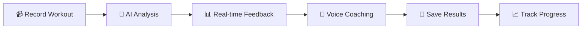

# 🏆 TalentTrack - AI-Powered Fitness Revolution

<div align="center">


[](https://rec-green.vercel.app)
[](LICENSE)

**Transform your fitness journey with AI-powered workout analysis, real-time coaching, and gamified challenges!**

[🚀 Get Started](#-quick-start) • [✨ Features](#-features) • [🎮 Modes](#-workout-modes) • [📱 Demo](#-demo) • [🛠️ Tech Stack](#-tech-stack)

</div>

---

## 🎯 What is TalentTrack?

TalentTrack is a next-generation fitness platform that combines **AI-powered pose detection**, **real-time voice coaching**, and **gamification** to make workouts more effective, engaging, and fun!

### 🌟 Why TalentTrack?

- 🤖 **AI-Powered Analysis** - MediaPipe pose detection for accurate rep counting
- 🎤 **Voice Coach** - ElevenLabs AI provides real-time encouragement
- 👻 **Ghost Mode** - Race against your previous best performances
- 🎯 **Test Mode** - Challenge yourself with timed fitness tests
- 📊 **Detailed Analytics** - Track progress with comprehensive metrics
- 🏅 **Gamification** - Challenges, badges, and leaderboards
- 👥 **Social Features** - Connect with friends and coaches
- 📱 **PWA Support** - Install as an app on any device

---

## 🎮 Workout Modes

### 💪 Normal Mode
Your standard workout experience with AI-powered rep counting and form analysis.

<div align="center">
  
  
  
</div>

**Features:**
- ✅ Real-time rep counting
- ✅ Form validation with skeleton overlay
- ✅ Voice coaching every 2 seconds
- ✅ Detailed performance metrics
- ✅ Video recording with annotations

### 👻 Ghost Mode - Race Your Best Self!

<div align="center">
  
</div>

**The Ultimate Challenge:**
- 🏃 Race against your previous best performance
- 👻 See your "ghost" performing alongside you
- 📈 Real-time comparison of reps and pace
- 🎯 Beat your personal records
- 🔥 Competitive motivation like never before

**How it works:**
1. Complete a workout to set your baseline
2. Enter Ghost Mode and select your ghost
3. Race against your past self in real-time
4. Try to beat your previous performance!

### 🎯 Test Mode - Timed Challenges

Push your limits with timed fitness tests:
- ⏱️ 30-second, 1-minute, or 2-minute challenges
- 🏆 Compete for high scores
- 📊 Track your progress over time
- 🎖️ Earn badges for achievements

---

## ✨ Features

### 🏋️ Supported Workouts

<table>
<tr>
<td align="center">
<br/>
<b>Push-ups</b><br/>
Elbow angle tracking
</td>
<td align="center">
<br/>
<b>Pull-ups</b><br/>
Chin-over-bar detection
</td>
<td align="center">
<br/>
<b>Sit-ups</b><br/>
Torso angle validation
</td>
</tr>
<tr>
<td align="center">
<br/>
<b>Squats</b><br/>
Knee angle tracking
</td>
<td align="center">
<br/>
<b>Vertical Jump</b><br/>
Height measurement
</td>
<td align="center">
<br/>
<b>Shuttle Run</b><br/>
Distance tracking
</td>
</tr>
<tr>
<td align="center">
<br/>
<b>Sit & Reach</b><br/>
Flexibility test
</td>
<td align="center">
<br/>
<b>Knee Push-ups</b><br/>
Modified version
</td>
<td align="center">
<b>+ More!</b><br/>
Wide-arm, Inclined, etc.
</td>
</tr>
</table>

### 🎤 AI Voice Coach

Powered by **ElevenLabs AI**, get real-time encouragement during workouts:

- 🗣️ **Dynamic Feedback** - "10 reps! You're crushing it!"
- 💪 **Form Corrections** - "Watch your posture!"
- 🔥 **Energy Boosts** - "You're on fire! Keep pushing!"
- 🎯 **Milestone Celebrations** - "New record! 50 reps!"
- 👤 **Personalized** - Uses your name for motivation

**Voice Options:**
- 👨 **Adam** - Deep, authoritative male voice
- 👩 **Freya** - Natural, warm female voice

### 📊 Analytics & Tracking

<div align="center">

| Feature | Description |
|---------|-------------|
| 📈 **Progress Tracking** | View your improvement over time |
| 🎯 **Form Analysis** | Detailed rep-by-rep breakdown |
| 📸 **Rep Screenshots** | Individual frames for each rep |
| 🎥 **Video Playback** | Watch your workout with skeleton overlay |
| 📄 **PDF Reports** | Downloadable workout summaries |
| 📊 **Statistics** | Accuracy, duration, calories, and more |

</div>

### 👥 Social & Coaching Features

- 🤝 **Connect with Friends** - Follow and motivate each other
- 👨‍🏫 **Coach Dashboard** - Coaches can monitor athlete progress
- 🏅 **Leaderboards** - Compete with others
- 🎖️ **Badges & Achievements** - Unlock rewards
- 💬 **FitFranken AI Chat** - Get workout advice anytime

### 🏛️ SAI Admin Dashboard

Special features for Sports Authority of India:
- 📊 **National Leaderboard** - Top athletes across India
- 📅 **Event Scheduling** - Manage competitions and training
- 🔍 **Talent Scouting** - Identify promising athletes
- 📈 **Analytics Dashboard** - Comprehensive performance metrics

---

## 🚀 Quick Start

### 🌐 Try it Online

Visit **[https://rec-green.vercel.app](https://rec-green.vercel.app)** - No installation required!

### 💻 Run Locally

```bash
# Clone the repository
git clone https://github.com/tharunkumardeveloper/rec.git
cd rec

# Install dependencies
npm install

# Start development server
npm run dev
```

Open **http://localhost:5173** in your browser.

### 📦 Requirements

- Node.js 16+
- Modern browser (Chrome recommended)
- Webcam (for live workouts)

---

## 🛠️ Tech Stack

<div align="center">

### Frontend


### AI & ML


### Backend


### Deployment


</div>

---

## 📱 Demo

### 🎬 Watch TalentTrack in Action

<div align="center">

| Feature | Demo |
|---------|------|
| 💪 **Normal Workout** |  |
| 👻 **Ghost Mode** | Race against your best performance |
| 🎯 **Test Mode** | Timed challenges with leaderboards |
| 📊 **Analytics** | Detailed performance metrics |

</div>

---

## 🎯 How It Works



1. **📹 Record** - Use your webcam or upload a video
2. **🤖 AI Analysis** - MediaPipe detects your pose and counts reps
3. **📊 Real-time Feedback** - See skeleton overlay and metrics
4. **🎤 Voice Coaching** - Get encouragement every 2 seconds
5. **💾 Save Results** - Store workout data and videos
6. **📈 Track Progress** - View analytics and improvements

---

## 🎮 User Roles

### 🏃 Athlete
- Complete workouts with AI analysis
- Track personal progress
- Compete in challenges
- Connect with friends
- Earn badges and achievements

### 👨‍🏫 Coach
- Monitor athlete performance
- View detailed workout analytics
- Create training content
- Assign workouts
- Track team progress

### 🏛️ SAI Admin
- National leaderboard management
- Event scheduling
- Talent scouting
- Comprehensive analytics
- Multi-coach oversight

---

## 🌟 Key Features Breakdown

### 🎯 Accuracy
- **MediaPipe Pose Detection** - Industry-leading accuracy
- **Angle Tracking** - Precise joint angle measurements
- **Form Validation** - Real-time posture checking
- **Rep Counting** - Reliable and consistent

### 🎤 Voice Coaching
- **ElevenLabs AI** - Ultra-realistic voice synthesis
- **Dynamic Messages** - Varies based on performance
- **Personalized** - Uses your name
- **Emotional Intelligence** - Adapts tone to your progress

### 👻 Ghost Mode
- **Visual Comparison** - See your ghost performing
- **Real-time Racing** - Compete against yourself
- **Motivation** - Push harder to beat your record
- **Progress Tracking** - See improvement over time

### 📊 Analytics
- **Rep-by-Rep Breakdown** - Detailed analysis
- **Video Playback** - Watch with skeleton overlay
- **Screenshots** - Individual frames per rep
- **PDF Reports** - Downloadable summaries
- **Progress Graphs** - Visualize improvements

---

## 🔧 Configuration

### 🎤 Voice Coach Setup

1. Get your ElevenLabs API key from [elevenlabs.io](https://elevenlabs.io)
2. Create `.env.local` file:
```env
VITE_ELEVENLABS_API_KEY=your_api_key_here
```
3. Restart the dev server
4. Go to Settings > Voice Coach to test

See [ELEVENLABS_SETUP.md](ELEVENLABS_SETUP.md) for detailed instructions.

### 🗄️ MongoDB Setup

Backend uses MongoDB for data storage. Configure in `.env`:
```env
MONGODB_URI=your_mongodb_connection_string
```

---

## 📚 Documentation

- 📖 **[QUICK_START.md](QUICK_START.md)** - Setup guide
- 🧪 **[TESTING_GUIDE.md](TESTING_GUIDE.md)** - Testing procedures
- 🏋️ **[WORKOUT_SETUP.md](WORKOUT_SETUP.md)** - Workout configuration
- 🎤 **[ELEVENLABS_SETUP.md](ELEVENLABS_SETUP.md)** - Voice coach setup
- 🏛️ **[SAI_ADMIN_FEATURES.md](SAI_ADMIN_FEATURES.md)** - SAI dashboard guide
- 👤 **[FACE_VERIFICATION_README.md](FACE_VERIFICATION_README.md)** - Face verification

---

## 🎨 Screenshots

<div align="center">

### 🏠 Home Screen
Beautiful, intuitive interface with activity cards and challenges

### 💪 Workout Interface
Real-time skeleton overlay with rep counting and form feedback

### 👻 Ghost Mode
Race against your previous best with side-by-side comparison

### 📊 Analytics Dashboard
Comprehensive metrics, graphs, and progress tracking

### 🏛️ SAI Admin Dashboard
National leaderboard, event management, and talent scouting

</div>

---

## 🚀 Deployment

### Frontend (Vercel)
```bash
# Deploy to Vercel
vercel --prod
```

### Backend (Render)
```bash
# Deploy to Render
git push origin main
```

Environment variables needed:
- `VITE_ELEVENLABS_API_KEY`
- `VITE_BACKEND_URL`
- `MONGODB_URI`
- `CLOUDINARY_CLOUD_NAME`
- `CLOUDINARY_API_KEY`
- `CLOUDINARY_API_SECRET`

---

## 🤝 Contributing

We welcome contributions! Here's how:

1. 🍴 Fork the repository
2. 🌿 Create a feature branch (`git checkout -b feature/amazing-feature`)
3. 💾 Commit your changes (`git commit -m 'Add amazing feature'`)
4. 📤 Push to the branch (`git push origin feature/amazing-feature`)
5. 🎉 Open a Pull Request

---

## 🐛 Troubleshooting

### Camera Not Working?
- ✅ Allow camera permissions in browser
- ✅ Close other apps using the camera
- ✅ Try Chrome (recommended browser)

### Voice Coach Not Speaking?
- ✅ Check ElevenLabs API key in `.env.local`
- ✅ Verify voice is enabled in Settings
- ✅ Clear browser cache and reload

### Backend Connection Issues?
- ✅ Ensure backend server is running
- ✅ Check `VITE_BACKEND_URL` in `.env.local`
- ✅ Verify MongoDB connection

See documentation for detailed troubleshooting.

---

## 📈 Performance

- ⚡ **Fast Processing** - Real-time pose detection at 30 FPS
- 🎥 **Video Recording** - Smooth 720p/1080p capture
- 💾 **Efficient Storage** - Cloudinary CDN for media
- 📱 **Mobile Optimized** - Works on phones and tablets
- 🌐 **PWA Support** - Install as native app

---

## 🎯 Roadmap

- [ ] 🌍 Multi-language support
- [ ] 📱 Native mobile apps (iOS/Android)
- [ ] 🎮 VR workout mode
- [ ] 🤖 Advanced AI coaching
- [ ] 🏆 Global competitions
- [ ] 📊 Advanced analytics with ML insights
- [ ] 👥 Team challenges
- [ ] 🎵 Music integration

---

## 🙏 Credits

Built with ❤️ using:

- **MediaPipe** - Google's ML framework for pose detection
- **ElevenLabs** - AI voice synthesis
- **React** - UI framework
- **shadcn/ui** - Beautiful component library
- **TailwindCSS** - Utility-first CSS
- **MongoDB** - Database
- **Cloudinary** - Media storage

---

## 📄 License

MIT License - See [LICENSE](LICENSE) for details

---

## 🎉 Get Started Now!

Ready to transform your fitness journey?

<div align="center">

[](https://rec-green.vercel.app)
[](https://github.com/tharunkumardeveloper/rec)

**💪 Start Training • 👻 Race Your Ghost • 🏆 Beat Your Records**

</div>

---

<div align="center">

Made with 💪 and 🤖 by the TalentTrack Team

[Website](https://rec-green.vercel.app) • [GitHub](https://github.com/tharunkumardeveloper/rec) • [Documentation](QUICK_START.md)

</div>
