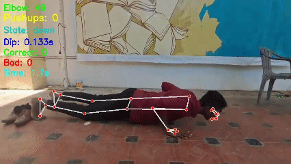
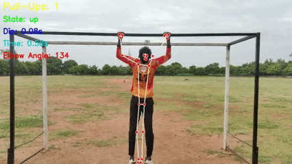
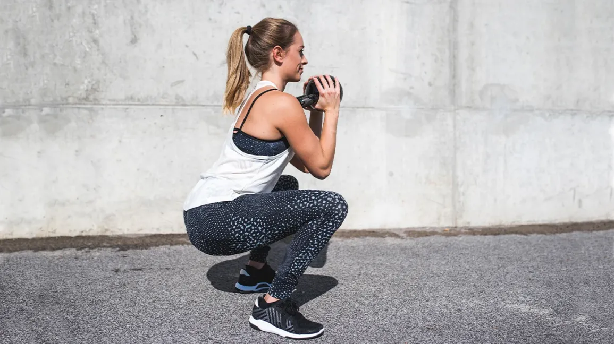
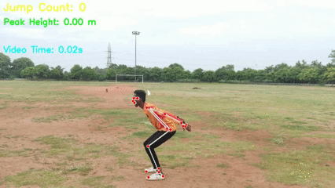
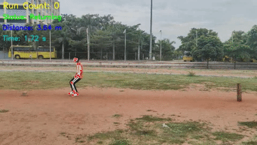
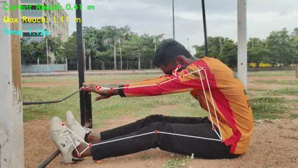
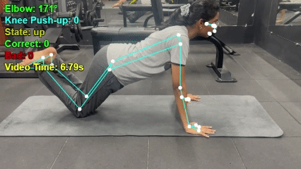
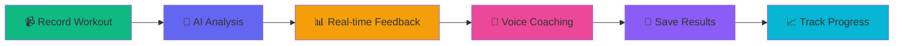

<div align="center">

# 🏆 TalentTrack - AI-Powered Fitness Revolution


[](https://rec-green.vercel.app)
[](https://github.com/tharunkumardeveloper/rec)
[](LICENSE)

### 🎯 Transform Your Fitness Journey with AI-Powered Workout Analysis

**Real-time Pose Detection • Voice Coaching • Ghost Mode Racing • Gamification**

[🚀 Quick Start](#-quick-start) • [✨ Features](#-features) • [🎮 Workout Modes](#-workout-modes) • [🛠️ Tech Stack](#️-tech-stack) • [📱 Demo](#-demo)

</div>

---

<div align="center">

## 🌟 What is TalentTrack?

TalentTrack is a **next-generation fitness platform** that combines cutting-edge **AI pose detection**, **real-time voice coaching**, and **gamification** to revolutionize how you work out!

### 💪 Why Choose TalentTrack?

</div>

<div align="center">
<table align="center">
<tr>
<td width="50%" align="center">

🤖 **AI-Powered Analysis**
- MediaPipe pose detection
- Accurate rep counting
- Real-time form validation
- Skeleton overlay visualization

🎤 **Voice Coach**
- ElevenLabs AI integration
- Real-time encouragement
- Personalized feedback
- Multiple voice options

</td>
<td width="50%" align="center">

👻 **Ghost Mode**
- Race your best performances
- Visual ghost comparison
- Beat personal records
- Competitive motivation

📊 **Advanced Analytics**
- Detailed progress tracking
- Rep-by-rep breakdown
- Video playback
- PDF reports

</td>
</tr>
</table>
</div>

</div>

---

<div align="center">

## 🎮 Workout Modes

### 💪 Normal Mode - AI-Powered Training





**Real-time rep counting • Form validation • Voice coaching • Performance metrics**

</div>

<div align="center">

### 👻 Ghost Mode - Race Your Best Self!


**The Ultimate Challenge: Compete Against Your Previous Best Performance**

</div>

<div align="center">
<table>
<tr>
<td align="center" width="25%">
<br/>
<b>Race Your Ghost</b><br/>
See your past performance<br/>alongside current workout
</td>
<td align="center" width="25%">
<br/>
<b>Real-time Comparison</b><br/>
Live rep count and<br/>pace comparison
</td>
<td align="center" width="25%">
<br/>
<b>Beat Records</b><br/>
Push harder to surpass<br/>your personal best
</td>
<td align="center" width="25%">
<br/>
<b>Stay Motivated</b><br/>
Competitive edge like<br/>never before
</td>
</tr>
</table>
</div>

<div align="center">

### 🎯 Test Mode - Timed Challenges

**⏱️ 30-second • 1-minute • 2-minute challenges**

Push your limits • Compete for high scores • Track progress • Earn badges

</div>

---

## ✨ Features

<div align="center">

### 🏋️ Supported Workouts

</div>

<div align="center">
<table>
<tr>
<td align="center" width="33%">
<br/>
<b>💪 Push-ups</b><br/>
<sub>Elbow angle tracking</sub>
</td>
<td align="center" width="33%">
<br/>
<b>🏋️ Pull-ups</b><br/>
<sub>Chin-over-bar detection</sub>
</td>
<td align="center" width="33%">
<br/>
<b>🧘 Sit-ups</b><br/>
<sub>Torso angle validation</sub>
</td>
</tr>
<tr>
<td align="center">
<br/>
<b>🦵 Squats</b><br/>
<sub>Knee angle tracking</sub>
</td>
<td align="center">
<br/>
<b>🚀 Vertical Jump</b><br/>
<sub>Height measurement</sub>
</td>
<td align="center">
<br/>
<b>🏃 Shuttle Run</b><br/>
<sub>Distance tracking</sub>
</td>
</tr>
<tr>
<td align="center">
<br/>
<b>🤸 Sit & Reach</b><br/>
<sub>Flexibility test</sub>
</td>
<td align="center">
<br/>
<b>🦵 Knee Push-ups</b><br/>
<sub>Modified version</sub>
</td>
<td align="center">
<br/><br/>
<b>➕ More Variations</b><br/>
<sub>Wide-arm, Inclined, etc.</sub>
</td>
</tr>
</table>
</div>

---

<div align="center">

### 🎤 AI Voice Coach - Your Personal Trainer


**Powered by ElevenLabs AI - Ultra-Realistic Voice Synthesis**

</div>

<div align="center">
<table>
<tr>
<td width="50%" align="center">

**🗣️ Dynamic Feedback**
- "10 reps! You're crushing it!"
- "Keep that form perfect!"
- "You're on fire! Don't stop!"

**💪 Form Corrections**
- Real-time posture alerts
- Technique improvements
- Safety reminders

</td>
<td width="50%" align="center">

**🎯 Milestone Celebrations**
- "New personal record!"
- "50 reps achieved!"
- "You're unstoppable!"

**👤 Personalized Motivation**
- Uses your name
- Adapts to your pace
- Emotional intelligence

</td>
</tr>
</table>
</div>

<div align="center">

**Voice Options:**  
👨 **Adam** - Deep, authoritative male voice  
👩 **Freya** - Natural, warm female voice

</div>

---

<div align="center">

### 📊 Analytics & Progress Tracking

</div>

<div align="center">
<table>
<tr>
<td align="center" width="20%">
<br/>
<b>Progress Tracking</b><br/>
<sub>View improvement<br/>over time</sub>
</td>
<td align="center" width="20%">
<br/>
<b>Form Analysis</b><br/>
<sub>Rep-by-rep<br/>breakdown</sub>
</td>
<td align="center" width="20%">
<br/>
<b>Rep Screenshots</b><br/>
<sub>Individual frames<br/>for each rep</sub>
</td>
<td align="center" width="20%">
<br/>
<b>Video Playback</b><br/>
<sub>Watch with skeleton<br/>overlay</sub>
</td>
<td align="center" width="20%">
<br/>
<b>PDF Reports</b><br/>
<sub>Downloadable<br/>summaries</sub>
</td>
</tr>
</table>
</div>

---

<div align="center">

### 👥 Social & Coaching Features

</div>

<div align="center">
<table>
<tr>
<td width="50%" align="center">

**🤝 Social Connection**
- Follow friends
- Share achievements
- Motivate each other
- Join challenges together

**🏅 Gamification**
- Leaderboards
- Badges & achievements
- Daily challenges
- Streak tracking

</td>
<td width="50%" align="center">

**👨‍🏫 Coach Dashboard**
- Monitor athlete progress
- View detailed analytics
- Create training content
- Assign workouts
- Track team performance

**💬 AI Chat Support**
- FitFranken AI assistant
- Get workout advice
- Form tips
- Nutrition guidance

</td>
</tr>
</table>
</div>

---

<div align="center">

### 🏛️ SAI Admin Dashboard

**Special Features for Sports Authority of India**

</div>

<div align="center">
<table>
<tr>
<td align="center" width="25%">
<br/>
<b>National Leaderboard</b><br/>
<sub>Top athletes across India</sub>
</td>
<td align="center" width="25%">
<br/>
<b>Event Scheduling</b><br/>
<sub>Manage competitions</sub>
</td>
<td align="center" width="25%">
<br/>
<b>Talent Scouting</b><br/>
<sub>Identify promising athletes</sub>
</td>
<td align="center" width="25%">
<br/>
<b>Analytics Dashboard</b><br/>
<sub>Comprehensive metrics</sub>
</td>
</tr>
</table>
</div>

---

<div align="center">

## 🚀 Quick Start

### 🌐 Try it Online - No Installation Required!

[](https://rec-green.vercel.app)

</div>

<div align="center">

### 💻 Run Locally

</div>

```bash
# Clone the repository
git clone https://github.com/tharunkumardeveloper/rec.git
cd rec

# Install dependencies
npm install

# Start development server
npm run dev
```

Open **http://localhost:5173** in your browser and start training! 💪

<div align="center">

### 📦 Requirements

✅ Node.js 16+ • ✅ Modern browser (Chrome recommended) • ✅ Webcam (for live workouts)

</div>

---

<div align="center">

## 🛠️ Tech Stack

</div>

<div align="center">

### Frontend


### AI & Machine Learning


### Backend & Database


### Deployment


</div>

---

<div align="center">

## 📱 Demo

### 🎬 Watch TalentTrack in Action

</div>

| Feature | Demo | Description |
|---------|------|-------------|
| 💪 **Normal Workout** |  | AI-powered rep counting with real-time form analysis |
| 👻 **Ghost Mode** |  | Race against your previous best performance |
| 🎯 **Test Mode** | ⏱️ | Timed challenges with leaderboards and badges |
| 📊 **Analytics** | 📈 | Detailed performance metrics and progress tracking |

---

<div align="center">

## 🎯 How It Works

<div align="center">



</div>

<table>
<tr>
<td align="center" width="16.66%">
<b>1️⃣</b><br/>
📹<br/>
<b>Record</b><br/>
<sub>Use webcam or<br/>upload video</sub>
</td>
<td align="center" width="16.66%">
<b>2️⃣</b><br/>
🤖<br/>
<b>AI Analysis</b><br/>
<sub>MediaPipe detects<br/>pose & counts reps</sub>
</td>
<td align="center" width="16.66%">
<b>3️⃣</b><br/>
📊<br/>
<b>Feedback</b><br/>
<sub>See skeleton overlay<br/>& metrics</sub>
</td>
<td align="center" width="16.66%">
<b>4️⃣</b><br/>
🎤<br/>
<b>Coaching</b><br/>
<sub>Get encouragement<br/>every 2 seconds</sub>
</td>
<td align="center" width="16.66%">
<b>5️⃣</b><br/>
💾<br/>
<b>Save</b><br/>
<sub>Store workout data<br/>& videos</sub>
</td>
<td align="center" width="16.66%">
<b>6️⃣</b><br/>
📈<br/>
<b>Progress</b><br/>
<sub>View analytics &<br/>improvements</sub>
</td>
</tr>
</table>

</div>

---

<div align="center">

## 🎮 User Roles

</div>

<table>
<tr>
<td width="33%" align="center">

### 🏃 Athlete


**Your Fitness Journey**

✅ Complete AI-analyzed workouts  
✅ Track personal progress  
✅ Compete in challenges  
✅ Connect with friends  
✅ Earn badges & achievements  
✅ Access voice coaching  

</td>
<td width="33%" align="center">

### 👨‍🏫 Coach


**Team Management**

✅ Monitor athlete performance  
✅ View detailed analytics  
✅ Create training content  
✅ Assign workouts  
✅ Track team progress  
✅ Provide feedback  

</td>
<td width="33%" align="center">

### 🏛️ SAI Admin


**National Oversight**

✅ National leaderboard  
✅ Event scheduling  
✅ Talent scouting  
✅ Comprehensive analytics  
✅ Multi-coach management  
✅ Performance insights  

</td>
</tr>
</table>

---

<div align="center">

## 🔧 Configuration

</div>

### 🎤 Voice Coach Setup

1. Get your ElevenLabs API key from [elevenlabs.io](https://elevenlabs.io)
2. Create `.env.local` file:

```env
VITE_ELEVENLABS_API_KEY=your_api_key_here
```

3. Restart the dev server
4. Go to Settings > Voice Coach to test

📖 See [ELEVENLABS_SETUP.md](ELEVENLABS_SETUP.md) for detailed instructions.

### 🗄️ MongoDB Setup

Backend uses MongoDB for data storage. Configure in `.env`:

```env
MONGODB_URI=your_mongodb_connection_string
```

---

## 📚 Documentation

<div align="center">

[](ELEVENLABS_SETUP.md)
[](SAI_ADMIN_FEATURES.md)
[](FACE_VERIFICATION_README.md)

</div>

---

<div align="center">

## 🚀 Deployment

</div>

### Frontend (Vercel)

```bash
vercel --prod
```

### Backend (Render)

```bash
git push origin main
```

### Environment Variables

```env
VITE_ELEVENLABS_API_KEY=your_elevenlabs_key
VITE_BACKEND_URL=your_backend_url
MONGODB_URI=your_mongodb_uri
CLOUDINARY_CLOUD_NAME=your_cloud_name
CLOUDINARY_API_KEY=your_api_key
CLOUDINARY_API_SECRET=your_api_secret
```

---

<div align="center">

## 🤝 Contributing

We welcome contributions! Here's how:

</div>

1. 🍴 **Fork** the repository
2. 🌿 **Create** a feature branch (`git checkout -b feature/amazing-feature`)
3. 💾 **Commit** your changes (`git commit -m 'Add amazing feature'`)
4. 📤 **Push** to the branch (`git push origin feature/amazing-feature`)
5. 🎉 **Open** a Pull Request

---

<div align="center">

## 🐛 Troubleshooting

</div>

<table>
<tr>
<td width="33%">

### 📹 Camera Not Working?

✅ Allow camera permissions  
✅ Close other apps using camera  
✅ Try Chrome (recommended)  
✅ Check browser settings  

</td>
<td width="33%">

### 🎤 Voice Coach Silent?

✅ Check API key in `.env.local`  
✅ Verify voice is enabled  
✅ Clear browser cache  
✅ Test with different voice  

</td>
<td width="33%">

### 🔌 Backend Issues?

✅ Ensure server is running  
✅ Check `VITE_BACKEND_URL`  
✅ Verify MongoDB connection  
✅ Review server logs  

</td>
</tr>
</table>

---

## 📈 Performance

<div align="center">

⚡ **Real-time Processing** - 30 FPS pose detection  
🎥 **HD Recording** - Smooth 720p/1080p capture  
💾 **CDN Storage** - Fast Cloudinary media delivery  
📱 **Mobile Optimized** - Works on phones & tablets  
🌐 **PWA Support** - Install as native app  

</div>

---

<div align="center">

## 🎯 Roadmap

</div>

<table>
<tr>
<td width="50%">

### 🚀 Coming Soon

- [ ] 🌍 Multi-language support
- [ ] 📱 Native mobile apps (iOS/Android)
- [ ] 🎮 VR workout mode
- [ ] 🤖 Advanced AI coaching with ML insights

</td>
<td width="50%">

### 💡 Future Plans

- [ ] 🏆 Global competitions & tournaments
- [ ] 👥 Team challenges & group workouts
- [ ] 🎵 Music integration & rhythm sync
- [ ] 🏥 Integration with health apps

</td>
</tr>
</table>

---

## 🙏 Credits

<div align="center">

Built with ❤️ using amazing technologies:

**MediaPipe** - Google's ML framework for pose detection  
**ElevenLabs** - Ultra-realistic AI voice synthesis  
**React** - Modern UI framework  
**shadcn/ui** - Beautiful component library  
**TailwindCSS** - Utility-first CSS framework  
**MongoDB** - Flexible NoSQL database  
**Cloudinary** - Media storage & optimization  

</div>

---

<div align="center">

## 📄 License

MIT License - See [LICENSE](LICENSE) for details

</div>

---

<div align="center">

## 🎉 Ready to Transform Your Fitness?

[](https://rec-green.vercel.app)
[](https://github.com/tharunkumardeveloper/rec)

### 💪 Start Training • 👻 Race Your Ghost • 🏆 Beat Your Records

---

Made with 💪 and 🤖 by the **TalentTrack Team**

[🌐 Website](https://rec-green.vercel.app) • [📂 GitHub](https://github.com/tharunkumardeveloper/rec) • [📖 Documentation](ELEVENLABS_SETUP.md)

</div>
